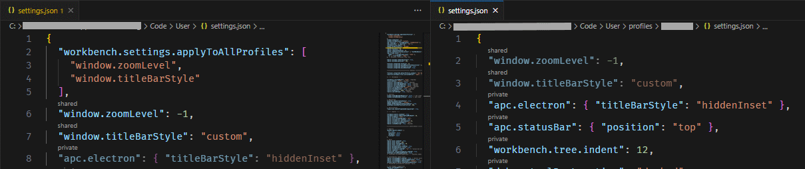

# vscode-configlens

Visual Studio Code extension streamlining the management of user settings across multiple profiles. It provides the ability to look up and control the scope/inheritability of individual settings (i.e. their inclusion in the "applyToAllProfiles" array) from other profiles' settings files.

## Notes

This is the initial proof-of-concept version. Currently, only tested on Windows. It's tested for performance but UX bugs are expected.

All modifications are applied via the `vscode` API - your files are NOT edited directly.

Feedback and requests are welcome!

## Roadmap

- lookup the value of inhertited settings
- go to and/or set the shared value of a setting from inheriting files
- make lens rendering conditional and configurable: only shared settings, only focused line, etc.
